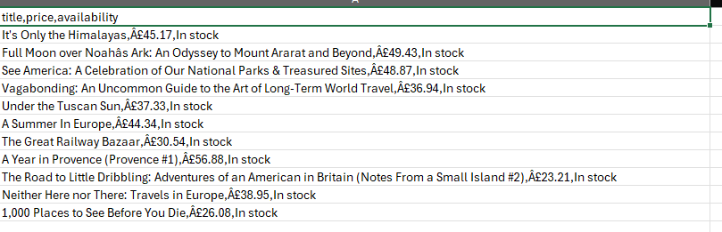

# E-commerce Data Scraper & Analyzer

## Problem

Manual price monitoring and stock tracking for online products is time-consuming and error-prone. This script automates product data collection from a category page, so you can analyze pricing and availability quickly.

## Tech Stack

- Python
- requests
- BeautifulSoup
- CSV

## Features

- Scrapes a product category page from https://books.toscrape.com/
- Extracts product title, price, and availability status
- Supports a configurable category URL and output file name
- Writes clean CSV output for easy analysis
- Includes error handling to avoid crashes when page elements are missing

## How to Run

1. Install Python 3.x if needed.
2. Open a terminal in the project folder.
3. Install dependencies:
pip install -r requirements.txt

4. Run the scraper:
python scrape_books.py

5. (Optional) Use a custom category URL or output file name:
python scrape_books.py https://books.toscrape.com/catalogue/category/books/mystery_3/index.html mystery_books.csv

6. Open the generated books_category.csv file in Excel, Google Sheets, or another spreadsheet tool.

## Results

---

### Notes

- The default category is the Travel books section.
- The script is designed to be easy to extend for additional data points or pagination.
